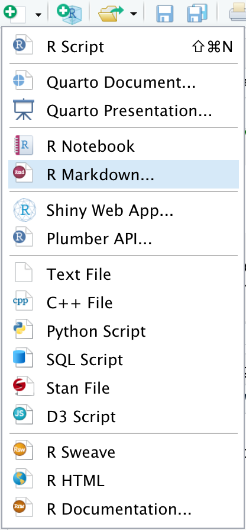

# HMSBootCamp

## Setup

Frequent GitHub and command line users can skip to the "Starting the Assignment" section. Once finished, see the file titled `specification.md` for the assignment specification.

### Command Line Basics

The command line is a text-based means of interacting with your computer. For the purposes of this bootcamp, it will allow you to navigate your folders (i.e. file directories) and utilize a program called git for version control. The following are basic commands you can use to get around the command line.

- `ls` "lists" files and directories directly inside the current directory
- `cd [folder-name]` "change directory" to the given path (relative to the current working directory)
- `cd ..` move up 1 step to the parent directory from the current directory
- `pwd` "print working directory" displays the full file path to the current directory

### Installing Git

Git is a program used for version control. For the purposes of this bootcamp, you will use it to track changes you make to your files/code. See instructions below for your operating system.

- MacOS
  - Opening **Terminal** will allow you to access the command line interface for your computer
  - GOOD NEWS: You probably already have git installed! Move on for now and reference the following bullet if you see `git: command not found` when trying to use a git command
  - Open the **Terminal** app and type in `xcode-select -install` to install a suite of useful tools for programming, including git
- Windows
  - Install git from the official [link](https://git-scm.com/download/win)
  - Opening **Git Bash** will allow you to access the command line interface on your computer

*At this point, open **Terminal** on MacOS or **Git Bash** on Windows and just try to navigate within a commonly used directory (e.g. Documents) using command line commands listed above!*

### Connecting to GitHub

1. Sign up for a free GitHub account with this [link](https://github.com/signup).
1. Open Git Bash
1. Paste the following text into your command line `ssh-keygen -t rsa -b 4096 -C "your_email@example.com"` and ***LEAVE THE FILE AND PASSPHRASE BLANK!*** Just hit enter for both.
1. Copy this unique key to your computer's clipboard by running...
    1. Windows: `cat ~/.ssh/id_rsa.pub | clip`
    1. MacOS: `pbcopy < ~/.ssh/id_rsa.pub`
1. Navigate to your [keys](https://github.com/settings/keys) page and click **New SSH key**
    1. Paste into the **Key** text box
    1. Write a title for the key (e.g. bootcampkey) in the **Title** text box
1. Confirm correct setup of the key by running `ssh -T git@github.com` and see official GitHub [documentation](https://docs.github.com/en/authentication/connecting-to-github-with-ssh/testing-your-ssh-connection) for the following steps.

*Setup adapted from official GitHub documentation, feel free to follow these [steps](https://docs.github.com/en/authentication/connecting-to-github-with-ssh/generating-a-new-ssh-key-and-adding-it-to-the-ssh-agent) if you would like to do so instead*

### Cloning Into Your Own Repository

1. Create a new repository at [github.com](https://github.com) by clicking the green **New** button.
    1. Fill in the **Repository name** box with: HMSBootCamp
    1. You may make the repository public
    1. DO NOT check **Add a README file**
    1. Click **Create Repository**
1. Use the command line in your **Terminal** (MacOS) or **Git Bash** (Windows) to navigate to a directory you want to store this assignment's folder in (e.g. Documents), run `git clone git@github.com/mbi6245/HMSBootCamp.git` in the command line.

    *TIP: refer to the above "Command Line" for instructions on how to `cd` into your desired directory*

1. Run `cd HMSBootCamp`
1. Run `git remote rename origin upstream`
1. Run `git remote add origin https://github.com/YOUR-ACCOUNT/HMSBootCamp.git`
1. Run `git push origin main`
<!-- 1. Run `git add .` followed by `git commit -m "initial commit"` -->

*Adapted from this stackoverflow post, feel free to follow these [steps](https://stackoverflow.com/a/44076938) if you would like to do so instead*

### Installing R/RStudio and Starting the Assignment

1. Navigate to the official RStudio [website](https://posit.co/download/rstudio-desktop/) and scroll down to the **DOWNLOAD AND INSTALL R** and **DOWNLOAD RSTUDIO DESKTOP** buttons; click both
1. Run the downloaded R language installer; you should just accept all default options by continuing to hit the **Next** buttons until you reach **Finish** or **Install**
1. Run the downloaded RStudio installer; you should also just accept all default options by continuing to hit the **Next** buttons until you reach **Finish** or **Install**
1. Open Rstudio and hit the drop down menu in the top left of your screen pictured below to create a new .Rmd file (you may be prompted to install some packages, please do so) titled Data_Analysis

    

1. Ensure that the new .Rmd file is in the `HMSBootCamp` directory you created above by saving the file (CTRL + s for Windows or Cmd + s for MacOS) and clicking on the correct folder in the graphical user interface.
1. See `specification.md` for next steps